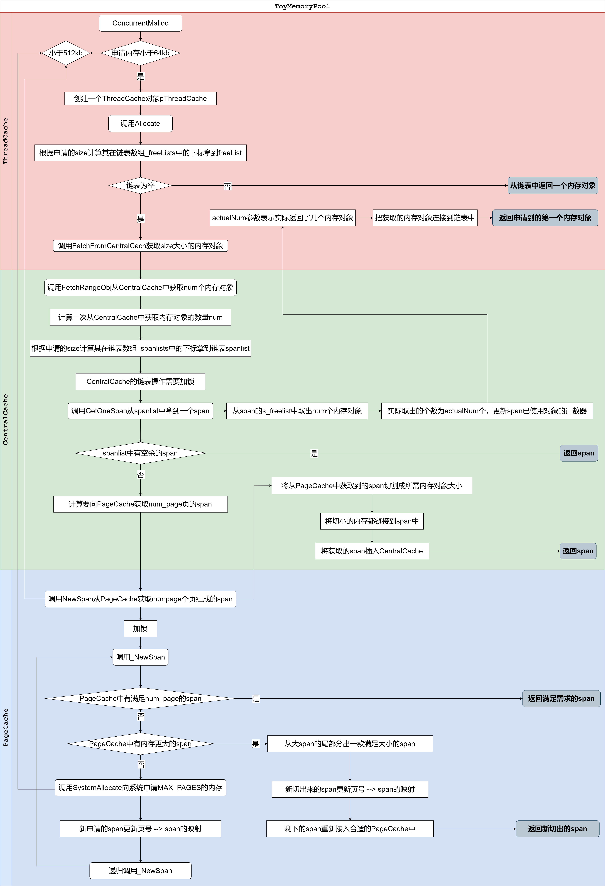
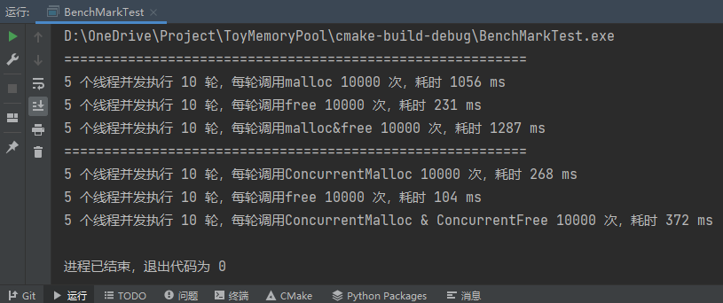

# ToyMemoryPool

基于TLS(thread local storage)的玩具级内存池

## 参考
- Google的[TCMalloc](https://github.com/google/tcmalloc) 
- [实现一个高并发内存池-----对比Malloc](https://blog.csdn.net/qq_41562665/article/details/90546750)

## 结构

## 接口

- ConcurrentMalloc

  用于申请内存，详细流程

- ConcurrentFree

  用于释放内存，详细流程

## 测试

