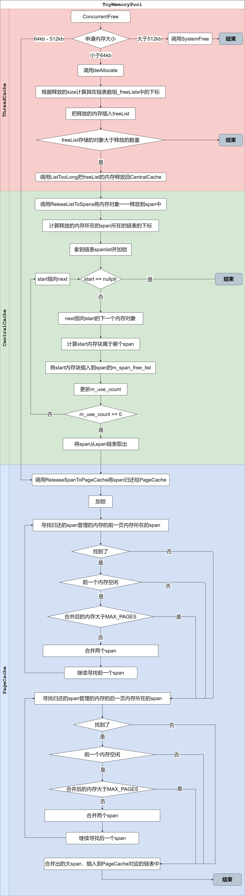

# ToyMemoryPool

基于TLS(thread local storage)的玩具级内存池

## 参考
- Google的[TCMalloc](https://github.com/google/tcmalloc) 
- CSDN博客：[实现一个高并发内存池-----对比Malloc](https://blog.csdn.net/qq_41562665/article/details/90546750)

## 设计实现

1. 内存池分为三层结构：ThreadCache、CentralCache、PageCache

   1. ThreadCache用于分配小于64kb的内存，且每个线程拥有独立的TLS，线程申请无需加锁，这也是本项目比较与malloc的在多线程并发条件下的高效之处
   2. CentralCache中央缓存均衡各个线程的内存申请和释放，防止资源饥饿。
   3. PageCache页缓存通过回收CentralCache中的空闲span(使用计数为0)，并合并相邻的页，缓解内存碎片的产生。Central Cache没有span时，从PageCache分配出一定数量的内存页，并切割成一定大小的小块内存，分配给Central Cache。

2. 项目中使用的几种数据结构

   1. span

      内存是按照页进行管理的，一页内存4kb。span是多个页的集合，并设计成一个双向链表的结构(有前后指针)

   2. FreeList

      

   3. spanList

      

   4. radix

      

3. 各层使用的数据机构

   1. ThreadCache

      

   2. CentralCache

      

   3. PageCache

      

4. 不足之处

   1. 并没有完全脱离系统的malloc，在建立数据结构对象(new Span)和申请大内存(>512kb)时，还是用到malloc
   2. 只是在Windows下面实现

## 接口

> 下面的函数流程图按照内存池的三层结构分成不同的颜色分区，红色表示ThreadCache中的操作，绿色表示CentralCache中的操作，蓝色表示PageCache中的操作。

- ConcurrentMalloc

  用于申请内存，详细流程

- ConcurrentFree

  用于释放内存，详细流程

## 测试

